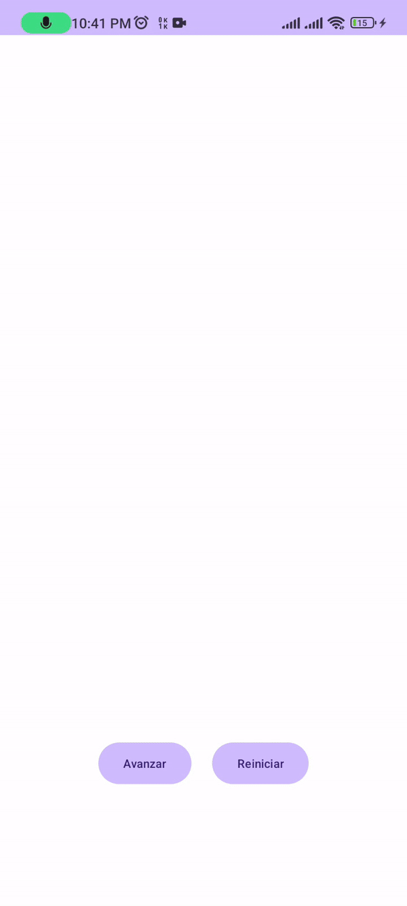

# Segunda Parte Examen



## Enlace del Video de Ejecución
[https://drive.google.com/file/d/1hTGGND73wb5hz1TI2azRhxkdUAiyFap-/view?usp=sharing](https://drive.google.com/file/d/1hTGGND73wb5hz1TI2azRhxkdUAiyFap-/view?usp=sharing)

## Desarrollo

```kotlin
class ArrowProgressView @JvmOverloads constructor(
    context: Context, attrs: AttributeSet? = null, defStyleAttr: Int = 0
) :     View(context, attrs, defStyleAttr) {


    private var progress = 0
    private val maxProgress = 5

    // Lista de puntos que definen la forma de la flecha
    val points = listOf(
        Pair(2f, 0f),
        Pair(4f, 2f),
        Pair(2f, 4f),
        Pair(0f, 4f),
        Pair(2f, 2f)
    )
    private val paintArrow = Paint().apply {
        color = Color.parseColor("#fce4dc")
        style = Paint.Style.FILL
        isAntiAlias = true
        strokeWidth = 10f

    }

    private var path: Path = Path()

    private var viewWidth = 0
    private var viewHeight = 0

    var arrowWidthScale = 0f


    override fun onSizeChanged(w: Int, h: Int, oldw: Int, oldh: Int) {
        super.onSizeChanged(w, h, oldw, oldh)
        viewWidth = w
        viewHeight = h

        // Actualiza el path de la flecha segun en el tamaño del view
        updatePath()
    }


    private fun updatePath(){
        arrowWidthScale = (viewWidth)/16f

        path.reset()
        path.moveTo(0f, 0f)
        points.forEach {
            path.lineTo(it.first*arrowWidthScale, it.second*arrowWidthScale)
        }
        path.close()
        invalidate()
    }


    // Dibuja la flecha progresiva en el canvas
    override fun onDraw(canvas: Canvas) {
        super.onDraw(canvas)

        // Dibuja figuras de flechas segun el valor de progress
        for (i in 0 until progress) {
            paintArrow.color = getLightingColor(Color.parseColor("#ffb574"), i)
            drawArrow(canvas, paintArrow, i)
        }
    }

    private val matrix = Matrix()

    // Dibuja una flecha en una posición específica.
    private fun drawArrow(canvas: Canvas, paint: Paint, position: Int) {

        matrix.reset()

        // Traslada la flecha horizontalmente según la posición y la escala.
        matrix.postTranslate(3f * position * arrowWidthScale, 0f)
        val transformedPath = Path(path)
        transformedPath.transform(matrix)

        // Dibuja el path transformado en el canvas.
        canvas.drawPath(transformedPath, paint)
    }

    // Incrementa el progreso y solicita un redibujo de la vista.
    fun advanceProgress() {
        if (progress < maxProgress) {
            progress++
            invalidate()
        }
    }
    // Reinicia el progreso a 0 y solicita un redibujo de la vista.
    fun resetProgress() {
        progress = 0
        invalidate()
    }
    // Calcula un color basado en la cantidad de progreso.
    private fun getLightingColor(baseColor: Int, step: Int): Int {
        val factor = 1f * step / maxProgress
        val r = ((Color.red(baseColor) * (1 - factor) * 1.5f).toInt()).coerceIn(0, 255)
        val g = ((Color.green(baseColor) * (1- factor) * 1.5f).toInt()).coerceIn(0, 255)
        val b = ((Color.blue(baseColor) * (1- factor) * 1.5f).toInt()).coerceIn(0, 255)
        return Color.rgb(r, g, b)
    }
}
